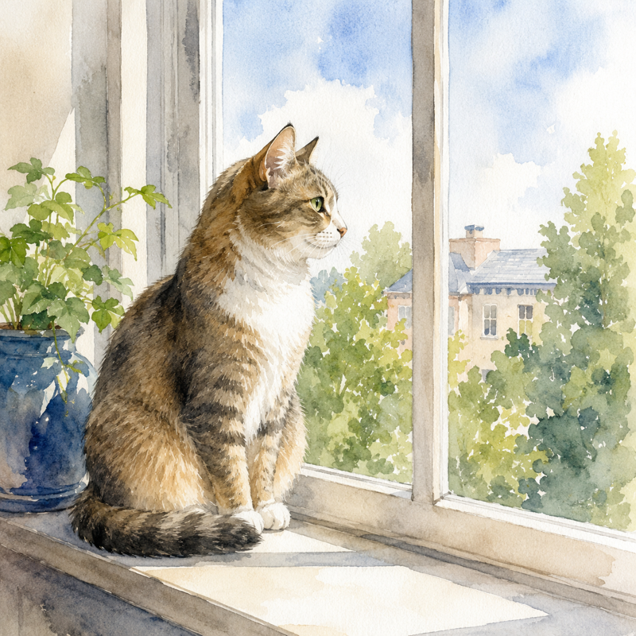
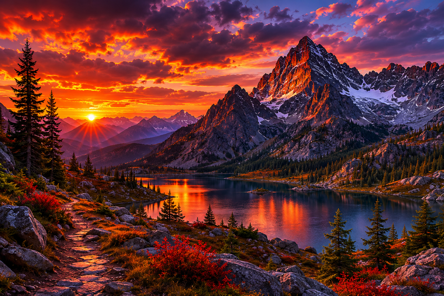
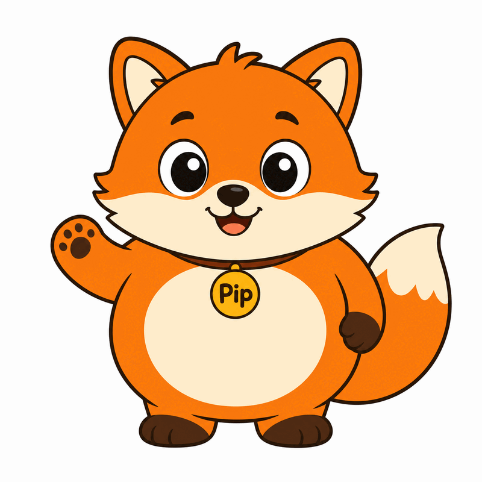
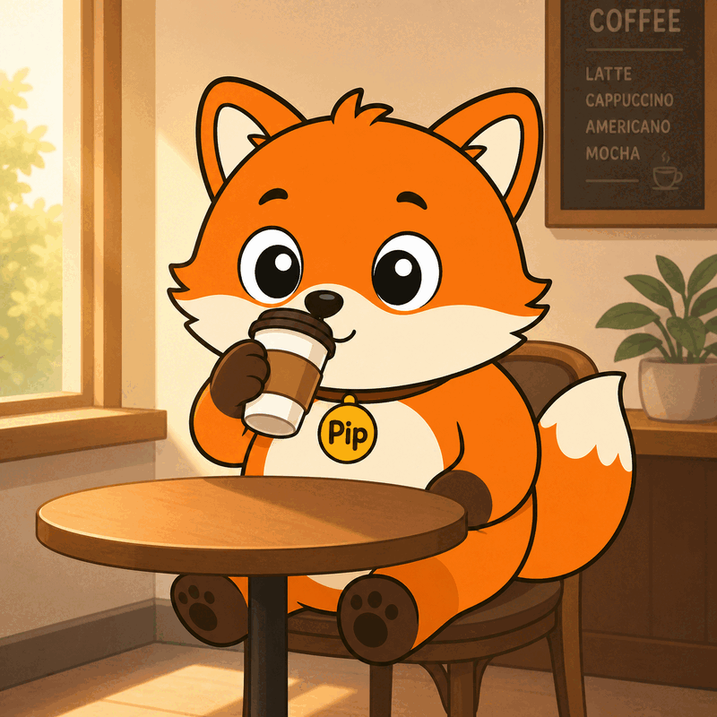

# chatgpt-imagegen

[](https://github.com/leeguooooo/chatgpt-imagegen/actions/workflows/ci.yml)

**English** | [中文](./README.zh-CN.md)

**Generate images with your ChatGPT subscription — no `OPENAI_API_KEY`.**

A tiny zero-dependency Python CLI (and AI-agent skill): one file, stdlib only. Works on a **free ChatGPT account** too — the default backend just drives the normal ChatGPT web chat, where even free-tier users get image generation.

```bash
chatgpt-imagegen "a watercolor cat sitting on a windowsill" -o cat.png
# -> saved: cat.png  (812,344 bytes)  size=1024x1024  quality=medium
```


---

## Install

Needs Python 3.10+ and a ChatGPT subscription (free tier works).

**For AI agents (recommended)** — drops the skill into Claude Code, Codex, Cursor, etc.:

```bash
npx skills add leeguooooo/chatgpt-imagegen -g
```

Then just ask: *"画一张 …"* / *"generate a hero banner for the README"*.

**Standalone CLI** — no `pip`, no virtualenv:

```bash
git clone https://github.com/leeguooooo/chatgpt-imagegen
sudo install chatgpt-imagegen/chatgpt-imagegen /usr/local/bin/chatgpt-imagegen
```

You also need **one backend** — `web` (default, drives your logged-in Chrome, spends no Codex-usage) or `codex` (headless fallback). `chatgpt-imagegen doctor` shows what's ready. → **[Backends & troubleshooting](https://drawstyle.leeguoo.com/en/docs/backends)**

Got a **Gemini** subscription too? Two more backends use it instead of OpenAI: `--backend gemini` (drives a logged-in `gemini.google.com` Chrome) and `--backend agy` (the Antigravity CLI, headless). They bill **separate quotas** from each other, so either can cover for the other. Neither is ever chosen automatically — ask by name. Pin the subscribed Chrome profile with `--gemini-profile`, since most profiles are signed in to *some* Google account. Note that Gemini **text-to-image** output carries a visible watermark in the bottom-right corner (image-to-image does not), and `--size` steers the aspect ratio there rather than the exact pixel count.

## Usage

```bash
chatgpt-imagegen "moody mountain sunset" -o web/hero.png --size 1536x1024
chatgpt-imagegen "make it a warm golden-hour photo, cinematic 35mm" -i photo.jpg   # reference the subject
chatgpt-imagegen "a different fictional person" --composition-ref photo.jpg        # borrow the framing, not the face
chatgpt-imagegen "a robot mascot" --style doodle                                    # apply a gallery style (auto-pulled + saved)
chatgpt-imagegen animate "a dog happily wagging its tail" --style-online snoopy --also-gif
OUT=$(chatgpt-imagegen "icon" --quiet)                                              # capture the path
```

All three below came straight out of the commands above — no retouching:

<table>
<tr>
<td width="33%"></td>
<td width="33%"></td>
<td width="33%"></td>
</tr>
<tr>
<td><sub><code>"a watercolor cat sitting on a windowsill"</code></sub></td>
<td><sub><code>"moody mountain sunset" --size 1536x1024</code></sub></td>
<td><sub><code>"a coffee shop logo, circular emblem"</code></sub></td>
</tr>
</table>

`animate` asks the image model for a strict 4×2 sprite sheet, crops eight equal
frames, rejects obvious subject drift, and writes a smooth ping-pong loop. It
defaults to animated WebP; pass `--animation-format gif` or `--also-gif` when
GIF compatibility matters. The source sprite PNG is always kept beside the
animation. Animation post-processing needs
[ImageMagick](https://imagemagick.org/) (`magick`); WebP output additionally
needs [libwebp](https://developers.google.com/speed/webp/download) (`img2webp`).
`chatgpt-imagegen doctor` reports whether both are installed.

Full options: `chatgpt-imagegen --help`. → **[Generate images](https://drawstyle.leeguoo.com/en/docs/generate)** · **[Styles](https://drawstyle.leeguoo.com/en/docs/styles)**

## Community styles

Browse and reuse art styles other people tuned — a public gallery at **[drawstyle.leeguoo.com](https://drawstyle.leeguoo.com)**. No script update needed:

```bash
chatgpt-imagegen "a fox barista" --style-online doodle  # generate with a gallery style, nothing saved
chatgpt-imagegen style search "watercolor mascot"       # search the gallery
chatgpt-imagegen style publish mystyle --category cute --from-last   # share yours (one-time login)
```

A style can pin a **character**, not just a look. Style assets carry reference images, so the same character comes back in a brand-new scene:

```bash
chatgpt-imagegen style add pip --kind character --ref pip-ref.png
chatgpt-imagegen "a fox barista" --style pip
```

<table>
<tr>
<td width="50%"></td>
<td width="50%"></td>
</tr>
<tr>
<td align="center"><sub>the pinned reference</sub></td>
<td align="center"><sub>generated from <code>"a fox barista"</code></sub></td>
</tr>
</table>

Gallery packages can be characters too — `xiaohei` is one.

→ **[Using gallery styles](https://drawstyle.leeguoo.com/en/docs/community)** · **[Submitting a style](https://drawstyle.leeguoo.com/en/docs/submit)**

## Learn more

- 📖 **[Full documentation](https://drawstyle.leeguoo.com/en/docs)** — install, generating, styles, backends, the platform.
- 🎨 **[Style gallery](https://drawstyle.leeguoo.com)** — browse and contribute community art styles.
- 📝 **[Deep dive (blog)](https://blog.leeguoo.com/en/posts/chatgpt-imagegen/)** — the design and principles behind it.
- ⚙️ **[How it works](./docs/how-it-works.md)** · **[HTTP API wrapper](https://github.com/leeguooooo/agent-cli-to-api)**

## License

MIT — see [LICENSE](./LICENSE).

## Disclaimer

This tool calls ChatGPT's internal `backend-api/codex` endpoint — the same one the official Codex CLI uses. It is not a documented public API; OpenAI could change or restrict it at any time. Use at your own risk and within the [OpenAI Terms of Use](https://openai.com/policies/row-terms-of-use/) — in particular, **do not use your ChatGPT subscription to power a public-facing image generation service**.

<details>
<summary>Keywords</summary>

`ChatGPT subscription image generation`, `free ChatGPT account image generation`, `use ChatGPT Plus for image API`, `gpt-image-2 without OPENAI_API_KEY`, `gpt-image-2 ChatGPT subscription`, `image_generation tool Responses API`, `ChatGPT image CLI`, `Codex CLI image_gen as standalone tool`, `DALL-E via ChatGPT Plus`, `OAuth-backed OpenAI image generation`, `no-API-key image generation`, `AI agent image generation skill`, `Claude Code image skill`, `OpenAI image generation without billing`.

**中文：** 用 ChatGPT 订阅生成图片、免费 ChatGPT 账号生图、ChatGPT Plus 生图工具、不用 API key 生图、gpt-image-2 用订阅、ChatGPT 订阅生图 CLI、Codex CLI 生图能力独立工具、给 AI agent 用的生图 skill、本地生图脚本、零依赖 Python 生图工具。
</details>
