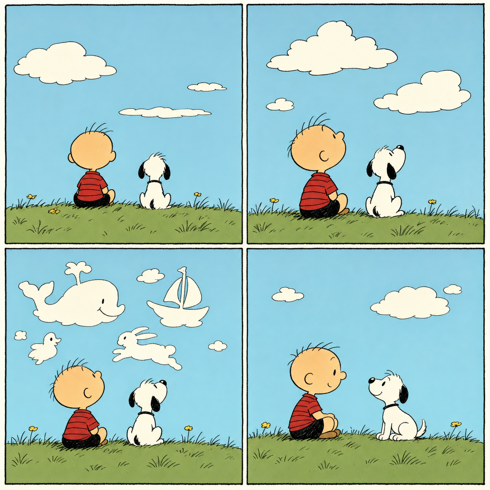
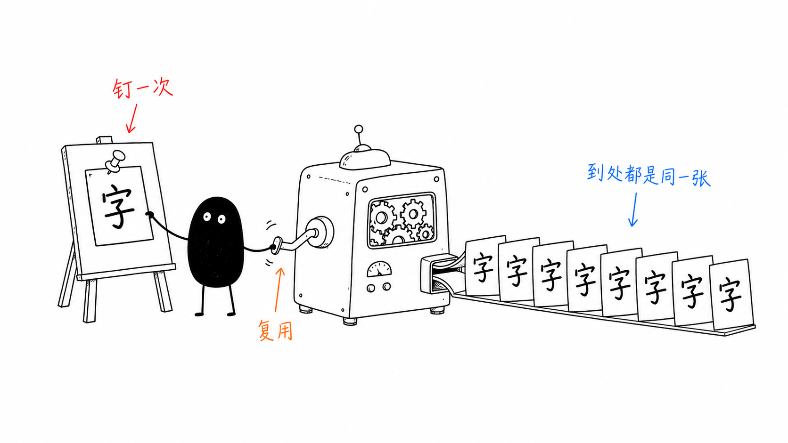

# Popular gallery styles

`chatgpt-imagegen` has **no built-in styles** — styles live in the community gallery at [drawstyle.leeguoo.com](https://drawstyle.leeguoo.com/) and your local library starts empty. A style is appended to your prompt so the same look carries across every generation — no need to paste a long style sentence each time.

```bash
chatgpt-imagegen "a cat typing on a laptop" --style doodle   # auto-pulls "doodle" from the gallery, then saves it
```

- **`--style NAME` auto-pulls** a name you don't have yet from the gallery and **saves it** to your library (offline-usable afterwards). Prefer `--style-online NAME` for a one-off that doesn't persist.
- `--style` is **repeatable** — stack a character and a style, e.g. `--style leo --style snoopy`.
- `--no-style` skips all active styles for one run.
- Browse or fetch explicitly with `style search <keyword>` / `style pull <slug>`; a name that isn't on the gallery fails fast pointing you at `style search`.
- Define your own (text and/or pinned reference images) with `style add` — see the [Styles & assets](../../SKILL.md#styles--assets) section.

The three styles below are popular gallery picks (pull them with the commands shown).

> Examples below were generated by the tool itself. Image generation is non-deterministic, so your results will differ in the details while keeping the look.

---

## `doodle`

A deliberately crude, low-res MS-Paint doodle — chunky blocks of color, scribbly lines, drawn as if with a mouse in an old paint program. Content stays readable; everything else is charmingly bad.

```bash
chatgpt-imagegen "a cat typing on a laptop" --style doodle
```


---

## `snoopy`

Classic Peanuts newspaper-comic look — simple wobbly pen-ink outlines, round-headed minimalist characters, flat muted retro colors, and sparse backgrounds. It transfers the *aesthetic* onto your subject (it doesn't copy any trademarked character).

```bash
chatgpt-imagegen "a beagle lying on his red doghouse with a little bird friend" --style snoopy
```



---

## `xiaohei`

Ian "小黑" hand-drawn explainer style — pure white background, thin wobbly black ink, lots of whitespace, and 小黑 (a solid black-blob character with white-dot eyes and stick legs) acting out one idea on an absurd machine, with sparse red/orange/blue handwritten Chinese annotations. Great for turning a concept in a Chinese article into one memorable figure. Pin a few example images as references (`style add-ref xiaohei `) for the tightest match.

```bash
chatgpt-imagegen "小黑 pins one card to a board, then a machine prints identical copies — pin once, reuse everywhere" --style xiaohei --size 1536x1024
```


